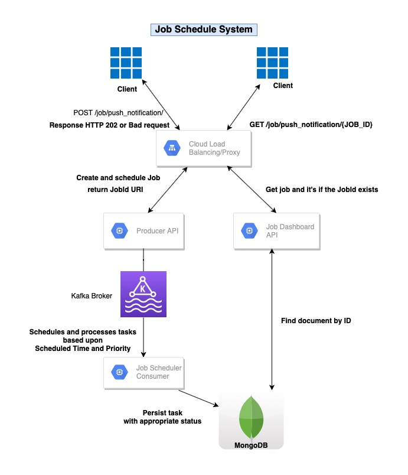
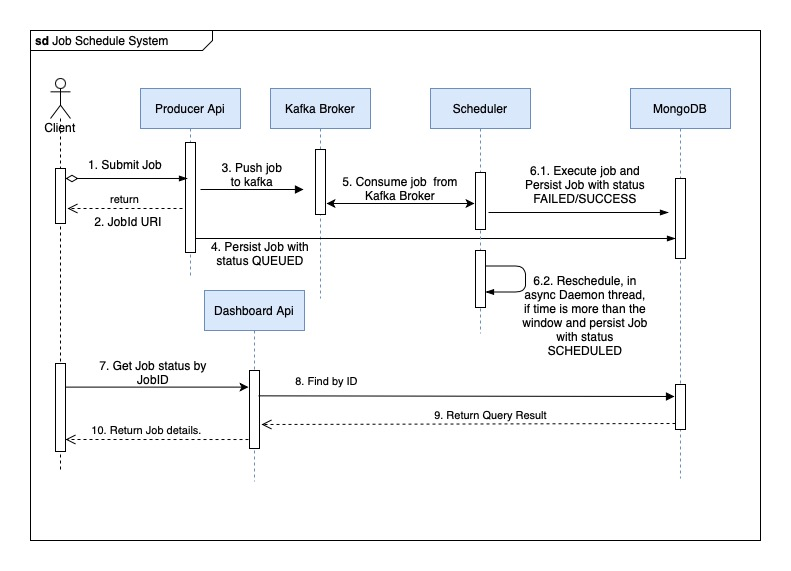
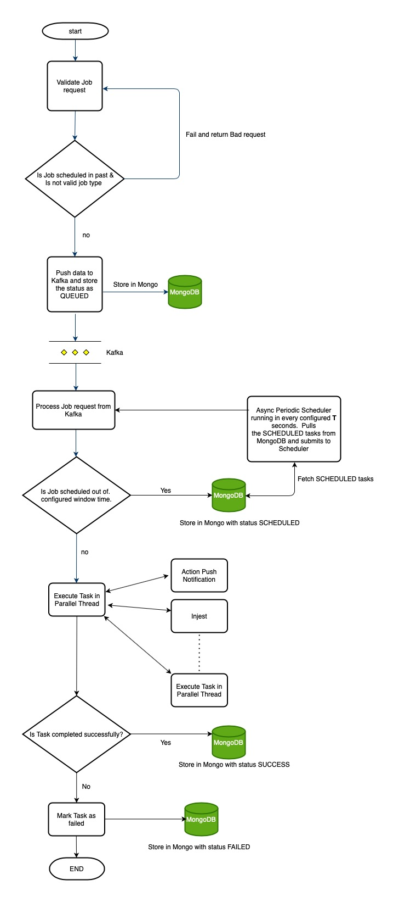
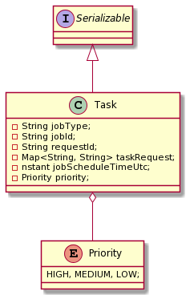
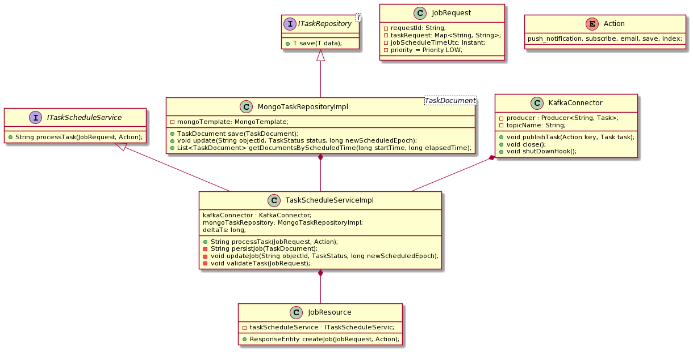
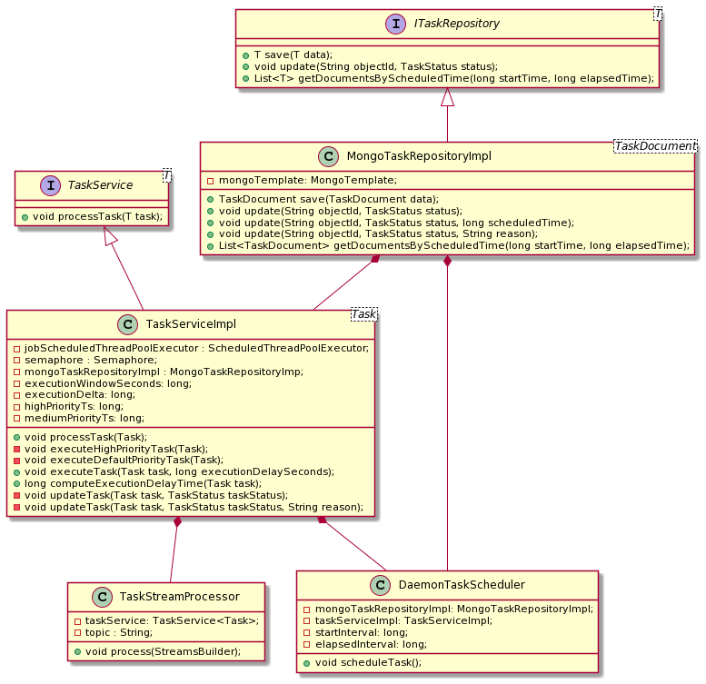

[](https://github.com/saurabh-slacklife/job-scheduler/actions/workflows/maven-and-docker-build.yml)

## Table of contents

* [Job Scheduling System](#job-scheduling-system)
* [Design](#design)
    * [Assumptions](#assumptions)
    * [Design Aspects](#design-aspects)
        * [Components](#components)
        * [High Level Architecture Diagram](#high-level-architecture-diagram)
        * [Sequence Diagram](#sequence-diagram)
        * [Flow chart](#flow-chart)
        * [Algorithm](#algorithm)
        * [Job States](#job-states)
        * [Job Actions](#job-actions)
        * [System Configuration and Tuning](#system-configuration-and-tuning)
        * [MongoDB Data Model](#mongodb-data-model)
    * [Design Considerations](#design-considerations)
        * [Why Java?](#why-java?)
        * [Why Spring core and Spring Boot?](#Why Spring core and Spring Boot?)
        * [Why Kafka Broker?](#why-kafka-broker?)
        * [Why MongoDB?](#why-mongoDB?)
    * [Project Structure](#project-structure)
        * [UML Diagram](#uml-diagram)
    * [Tech Stack](#tech-stack)
    * [Improvements or Enhancements](#improvements-or-enhancements)
    * [Not covered](#not-covered)
* [Runbook](#runbook)

### Job Scheduling System

### Design

#### Assumptions

1. Tasks are idempotent, every task is independent of other.
2. The scheduled time is always of Future.
3. All services run in UTC timezone and tasks are required to be submitted in UTZ only. Though there
   isn’t any validation to check if the supplied time zone is not UTC.
4. Additional state, SCHEDULED, is added for consistency.
5. Validation error results of REST endpoints are not custom handled and out of current MVP scope.

#### Design Aspects

* **Flexibility** - Below are the factors which describes flexibility of submitting and execution of
  multiple job
    1. Based on Action type in Post request in path variable
    2. New Actions can be defined in the system with their corresponding handling.
    3. The Request body is generic - the body of request is defined by Map<String, String>.

* **Reliability** :
    1. Each job is executed and processed in its own thread, i.e. for each submitted job is executed
       a separate thread from ScheduledThreadPoolExecutor. The thread can either fail or succeed.
    2. If a thread fails, corresponding status and reason is updated in MongoDB.
* **Internal Consistency** :
    1. It’s maintained at each level, when - Job is submitted, Job is submitted to Kafka broker, Job
       is consumed and processed in Scheduler, Job is/being executed. Hence, maintaining the
       required status. Refer [Job States](#job-states) for description of valid states.
* **Scheduling and Priority**:
    1. Scheduling is achieved by submitting the task at a given time which is not in older than the
       current UTC Timestamp, and a Delta seconds (**Δ<sub>ts</sub>**).
    2. The Ordering is guaranteed by using the value of Job Type as Topic partition key, when the
       job is submitted to Kafka broker. Ensuring each Job with same key goes to only specific
       Partition and is read by only one consumer group, thereby maintaining ordering.
    3. Scheduling is implemented through ScheduledThreadPool executor.
    4. The priority is defined as: HIGH, MEDIUM and LOW
        1. LOW: This is the default. With this priority, the job will be executed based upon its
           scheduled time stamp.
        2. HIGH: The high priority task will be executed in configured Delta seconds(defined
           by `${schedule.execution.high.priority-ts}`) from the current time and Scheduled
           timestamp is of Future.
           **The design can be changed**. The Queue size of Runnable in ScheduledThreadPool is
           configured with `scheduler ${service.executor.core.pool.max}` in current design. By
           setting the appropriate value, the Lower and Medium priority tasks will always be
           executed at their scheduled timestamp.
        3. MEDIUM: This is handled as same as LOW priority. Though this can be changed. The purpose
           is to describe how different logic can be handled. The scheduling can be defined similar
           to High by using (defined by `${schedule.execution.medium.priority-ts}`), but the
           implementation is not handled.

##### Components

- **Producer API (producer-api)**:
    - REST service which accepts/rejects and submit Job to Scheduler service through Kafka message
      broker.
- **Scheduler (scheduler)**:
    - Service which consumes message log from Kafka and schedules Jobs in ScheduledThreadPool
      executor.
    - This also has a Daemon Thread which keeps on polling job from MongoDB and send it to
      ScheduledThreadPool for processing. Implemented via Spring's @Scheduled.
- **Scheduler Dashboard API (job-scheduler-dashboard-api)**:
    - REST service which exposes endpoints to get the status and details of Job.
    - Endpoint: `GET /api/job/status/{jobId}`
- **Scheduler models (scheduler-models)**:
    - Contains the common data models.

##### High Level Architecture Diagram

<p align="center">
  
  <br/>
</p>

##### Sequence Diagram

<p align="center">
  
  <br/>
</p>

##### Flow chart

<p align="center">
  
  <br/>
</p>

##### Algorithm

Job **J** with Scheduled time **T<sub>sh</sub>**, and a **Δ<sub>ts</sub>** in Seconds:

* With default **Priority=LOW** OR **Priority=MEDIUM**:
    1. (T<sub>sh</sub> - CurrentTimestamp) < 0 &&  (T<sub>sh</sub> - CurrentTimestamp) \+ Δ<sub>
       ts</sub> < 0 **_then_** Don’t accept and return Bad Request.
    2. _**else-if**_  (T<sub>sh</sub> - CurrentTimestamp) > 0 **_then_** Accept and Schedule the
       job.
    3. _**else-if**_ (T<sub>sh</sub> - CurrentTimestamp) < 0 &&  (T<sub>sh</sub> - CurrentTimestamp)
       \+ Δ<sub>ts</sub> > 0 **_then_** Accept and Schedule the job.
* With **Priority=HIGH**:
    1. (T<sub>sh</sub> - CurrentTimestamp) < 0 &&  (T<sub>sh</sub> - CurrentTimestamp) \+ Δ<sub>
       ts</sub> < 0 **_then_** Don’t accept and return Bad Request.
    2. _**else-if**_  (T<sub>sh</sub> - CurrentTimestamp) > 0 **_then_** Accept and Schedule the job
       at Instant.now() + Δ<sub>ts</sub>.
    3. _**else-if**_ (T<sub>sh</sub> - CurrentTimestamp) < 0 &&  (T<sub>sh</sub> - CurrentTimestamp)
       \+ Δ<sub>ts</sub> > 0 **_then_** Accept and Schedule the job at Instant.now() + Δ<sub>
       ts</sub>.

NOTE: **Δ<sub>ts</sub>** is defined in `producer-api ${task.schedule.execution.delta-ts}`

To put a limit on the number of transactions, and a sustained load to MongoDB, a Semaphore is
created with configured count and fairness.

##### Job States

1. QUEUED - When the Job is submitted for execution and is waiting to be executed in
   ScheduledThreadPool based on it's scheduled timestamp.
2. SCHEDULED - When the Job is submitted for execution and is outside the defined execution window
   of ScheduledThreadPool based on it's scheduled timestamp as defined
   through `${task.schedule.execution.window-ts}`.
3. RUNNING - The Job is being executed by a thread from ScheduledThreadPool based on it's scheduled
   timestamp.
4. SUCCESS - The Submitted job is executed with Success.
5. FAILED - The Submitted job is executed with Failure and reason is stored in MongoDB for later
   retrieval.

##### Job Actions

Based on Action type or Job Type, the appropriate Implementation is executed as
defined [here](scheduler/src/main/java/io/jobscheduler/scheduler/action/ActionFactory.java)

As of now there isn't any implementation and job either succeeds or fails based on the return type.

Examples of [Job Action](scheduler/src/main/java/io/jobscheduler/scheduler/action/Action.java)
types:

1. push_notification - Succeeds the Job.
2. subscribe - Succeeds the Job.
3. email - Fails the Job.
4. save - fails the Job.
5. index - Fails the Job.

##### System Configuration and Tuning

- Kafka Configuration
    * Kafka Bootstrap Server: broker:9092
    * Kafka Topic: job-task-system
    * Kafka Topic Partition: 1
    * kafka Topic replica: 1

NOTE: The Topic Partitions, should be chosen wisely when deploying the system, since, the ordering
will depend on this.

- Scheduler Configurations
    - [ScheduledThreadPool](scheduler/src/main/java/io/jobscheduler/scheduler/components/ExecutorServiceEngine.java)
        * `executor.core.pool.min` # Number of minimum threads to keep in pool
        * `executor.core.pool.max` # Number of maximum threads to keep in pool. If it's exhausts,
          custom
          RejectedExecutionHandler [GrowAndSubmitPolicy](scheduler/src/main/java/io/jobscheduler/scheduler/components/GrowAndSubmitPolicy.java)
        * `executor.core.pool.keep-alive` # Self Explanatory
        * `executor.core.pool.termination` # Self Explanatory
    - [TaskServiceImpl](scheduler/src/main/java/io/jobscheduler/scheduler/service/TaskServiceImpl.java)
        * `task.schedule.execution.window-ts` # Window of seconds for which Tasks are submitted to
          Thread pool. Thus, ThreadPool executes the task in Window
          of `schedule.execution.window-ts`
        * `task.schedule.execution.delta-ts` # Delta as described in [Algorithm](#algorithm)
        * `task.schedule.execution.high.priority-ts` # Delta as described in 'Scheduling and
          Priority' of [Design Aspects](#design-aspects)
        * `task.schedule.execution.medium.priority-ts` # Delta as described in 'Scheduling and
          Priority' of [Design Aspects](#design-aspects)
    - [DaemonTaskScheduler](scheduler/src/main/java/io/jobscheduler/scheduler/components/DaemonTaskScheduler.java)
        * A Spring @Scheduled thread which schedules Jobs which are submitted outside the
          window `task.schedule.execution.window-ts` as described above.
        * `task.daemon.execution.interval` Defines FixedInterval of this Daemon thread.
        * Fetch jobs from MongoDB with status as `Scheduled` based on filter range Instant.now()
          .toEpochSeconds() +
            * `task.daemon.execution.interval.query.start-interval` # Inclusive
            * `task.daemon.execution.interval.query.elapsed-interval` # Exclusive

##### MongoDB Data Model

1. Collection: `TaskDocument`
2. Indexes:
   **NOTE**: Keeping Indexes and Document structure open for discussion.

3. Object:

    ```java
    @Id
    String id;
    String requestId;
    String jobType;
    Map<String, String> taskRequest;
    long jobScheduleTimeSeconds;
    Priority priority;
    TaskStatus taskStatus;
    String reason;
    ```

    ```java
    public enum Priority {
      HIGH, MEDIUM, LOW;
    }
    ```

    ```java
    public enum TaskStatus {
      SCHEDULED, QUEUED, RUNNING, SUCCESS, FAILED;
    }
    ```

#### Design Considerations

**NOTE**: Keeping all the below questions open, open for discussion.

##### Why Java?

    * Why not Python?

##### Why Spring core and Spring Boot?

    * Why not Qaurkus or Dropwizard

##### Why Kafka Broker?

    * Why not any other logging queue?

##### Why MongoDB?

    * Why not Elasticsearch, HBase, Cassandra or RDBMS?

#### Project Structure

The services are independent of each other but are kept under on directory for submission and hence
are not dependent maven modules.

- **Producer API (producer-api)**:
    - REST service which accepts/rejects and submit Job to Scheduler service through Kafka message
      broker.
    - Endpoint: `POST /job/{jobType}`
    - Request Example:
  ```shell
  curl -X POST 'http://localhost:9000/job/push_notification/' \
  --header 'Content-Type: application/json' \
  --data-raw '{
  "requestId": "1234",
  "jobScheduleTimeUtc": "2021-05-14T15:01:55.00Z",
  "priority": "LOW",
  "taskRequest": {
  "name": "1",
  "hello": "saurabh123455"}
  }'
  ```
- **Scheduler (scheduler)**:
    - Service which consumes message log from Kafaka and schedules Jobs in ScheduledThreadPool
      executor.
- **Scheduler Dashboard API (job-scheduler-dashboard-api)**:
    - REST service which exposes endpoints to get the status and details of Job.
    - Endpoint: `GET /api/job/status/{jobId}`
- **Scheduler models (scheduler-models)**:
    - Contains the common data models.

##### UML Diagram

- Schedule Models

<p align="center">
  
  <br/>
</p>

- Producer API
  <p align="center">
  
  <br/>

</p>

- Scheduler

<p align="center">
  
  <br/>
</p>   

#### Tech Stack

* Application Code - Java 11
* IoC Container - Spring
* Data Persistence - MongoDB
* Message log - Kafka
* Message log consumer - KStreams

#### Improvements or Enhancements

1. The jobs are stored for processing in JVM custom ScheduledThreadPool. Now In case of JVM failure,
   and its ephemeral nature, the unprocessed jobs in thread pool will be lost.

   To handle this, Retry mechanism can be created which will pool **Non-Failed** or **Non-Success**
   jobs and execute again. When job is scheduled in ScheduledThreadPool, it is marked as **Queued**
   in MongoDB.

   Also, if retry is implemented - the system design and implementation should ensure that no two or
   more JVM are handling same tasks.

   Possible options:
    * This can be achieved through, Spring's @Scheduled thread running at fixedDelay or at
      fixedRate.
    * This can also be achieved through running a single serverless job which pulls jobs based on
      status and timeframe.
2. The definition of Priority and Scheduling (as combination) is quite vast and point of discussion.
3. The Dashboard API can be enhanced to have endpoints and functionality which can:
    * Search by window: Start time and Elapsed time
    * Find jobs by Status and Job Type
    * Support pagination
4. The Producer API and Dashboard API can be deployed behind a Proxy server - Envoy, HAPRoxy as an
   examples.
5. Support of Protobuf for both REST and Kafka DTOs, apart from Json.

#### Not covered

1. Container orchestration through K8s.
2. Proxy server for Producer API and Dashboard API.

### Runbook

[Runbook](RUNBOOK.md)

